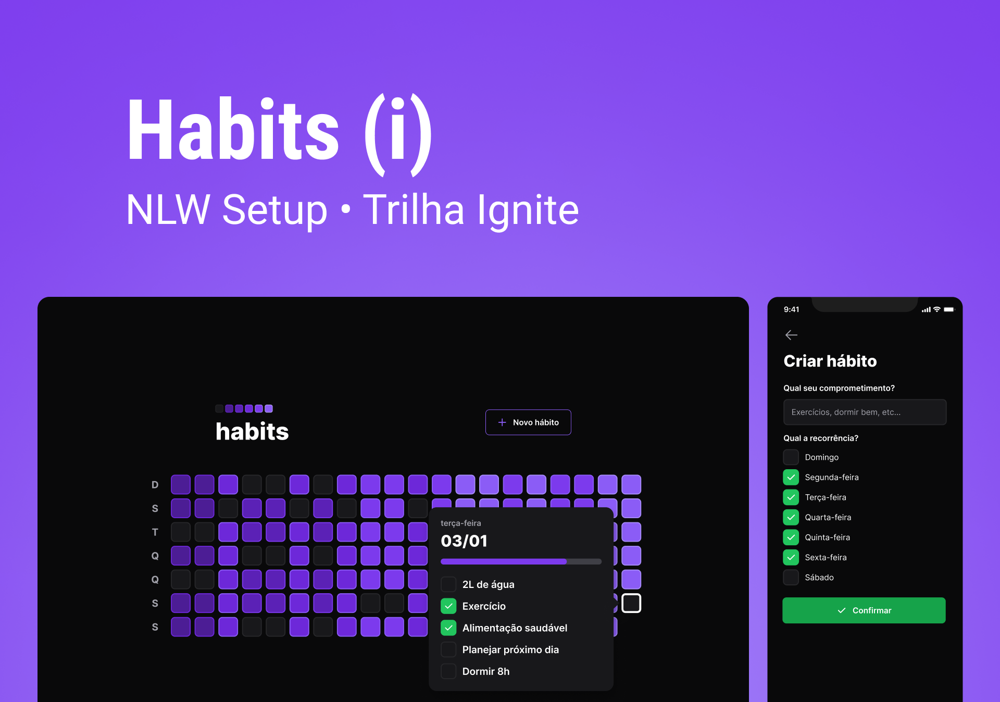

<h1 align="center">
    
</h1>

## 💻 Sobre o projeto

Aplicação desenvolvida durante a NLW Setup organizada pela Rocketseat, com a finalidade de criar hábitos.

Foi possível praticar muita coisa do universo JavaScript, por exemplo: Autenticação e rotas com o fastify, banco de dados com prisma, estilização na web com tailwindcss, estilização em apps mobile com native-base. Assim como uso e criação de hooks, tipagem e contextos.

Até o momento como extra eu adicionei login social, notificação push e perfil púbilco compartilhando o resumo dos hábitos do usuáio

---

## ⚙️ Funcionalidades

- Login social.
- Criar um novo hábito.
- Completar hábitos.
- Compartilhar perfil público dos hábitos.
- Notificação de hábitos ainda não concluídos no dia.

Para o desenvolvimento foram aplicados conceitos como:
- ContextAPI
- LocalStorage
- Hooks
- Routes
- Components
- Prisma
- Fastify
- Typescript

---

## 🛠 Tecnologias
As seguintes ferramentas foram usadas na construção do projeto:

#### **Website**  [Vite](https://vitejs.dev/)

-   **[Tailwindcss](https://tailwindcss.com/n)**

#### **Server**  [Nodejs](https://nodejs.org/en/)

-   **[Zod](https://axios-http.com/ptbr/docs/intro)**
-   **[Prisma](https://www.prisma.io/)**
-   **[Fastify](https://www.fastify.io/)**
-   **[Axios](https://www.npmjs.com/package/axios)**

#### **Mobile**  [Expo](https://nextjs.org/docs/getting-started)

-   **[Native base](https://tailwindcss.com/n)**
-   **[Axios](https://www.npmjs.com/package/axios)**
-   **[React navigation](https://reactnavigation.org/)**
-   **[Dayjs](https://www.npmjs.com/package/dayjs)**
-   **[Auth session](https://docs.expo.dev/versions/latest/sdk/auth-session/)**
-   **[Clsx](https://www.npmjs.com/package/clsx)**
-   **[Nativewind](https://www.npmjs.com/package/nativewind)**

---

## 🦸 Autor

  
 <b>Everton Schultz</b></a>
  

